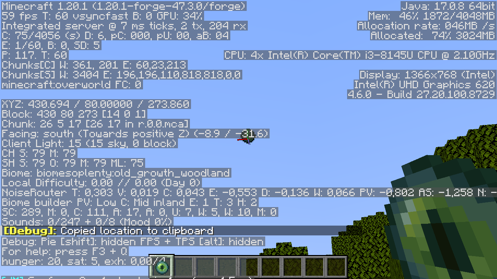
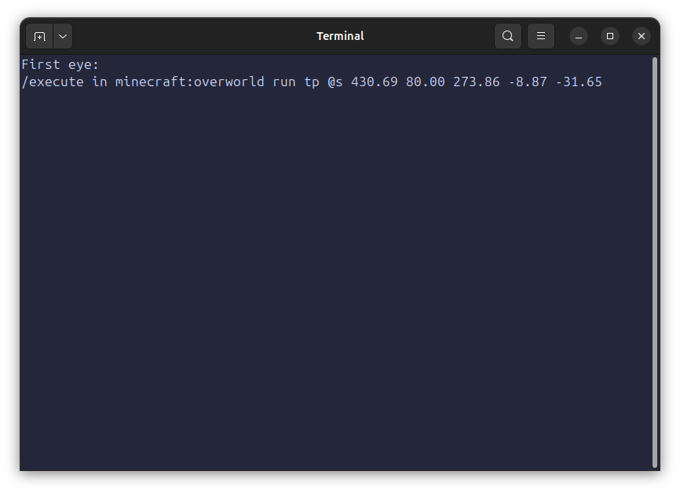
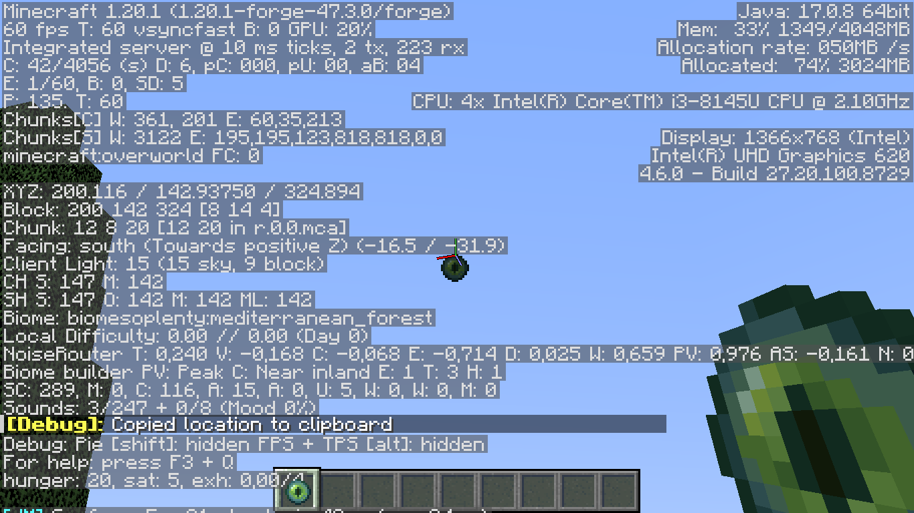
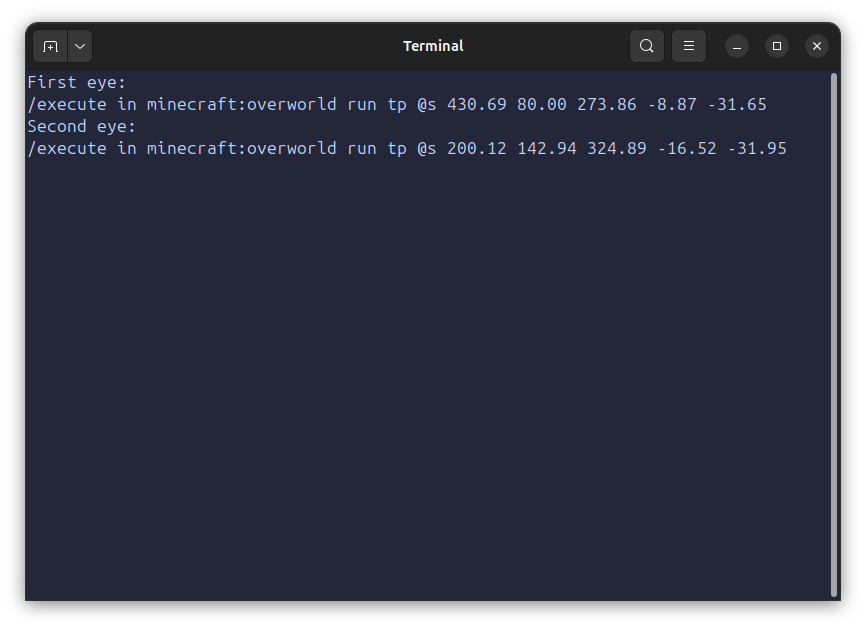
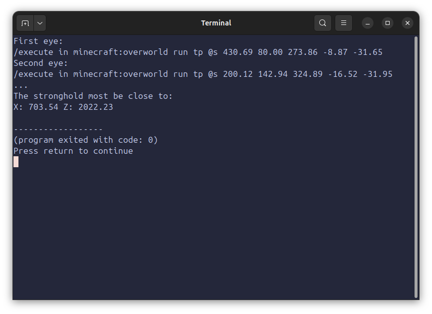
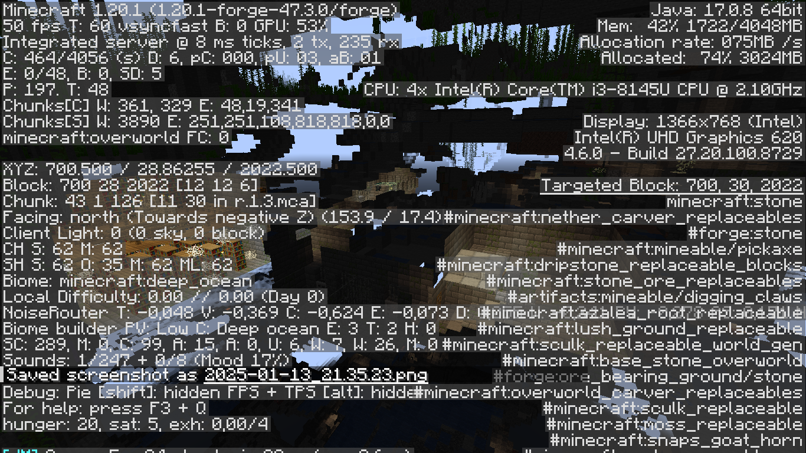
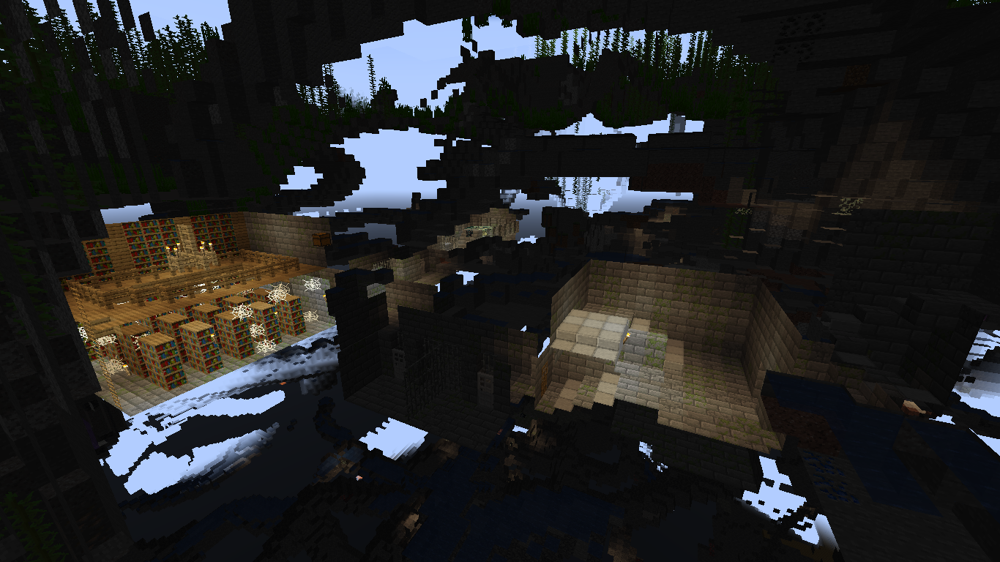

# minecraft-stronghold-finder
This program calculates the location of a Minecraft stronghold by triangulating the position from two Eye of Ender throws. It uses the intersection of the two directional lines based on their coordinates and angles to estimate the stronghold’s location.

# How to Use

### 1. Throw the First Eye of Ender

Throw an Eye of Ender in any direction and **position the crosshair directly on it** as it flies.
Press **F3 + C** to copy the location information (coordinates and angles) to your clipboard.

Then, paste the copied information into the program.

### 2. Throw the Second Eye of Ender

Move to a different location and throw another Eye of Ender.
Position the crosshair directly on the Eye, and press **F3 + C** again to copy the new coordinates.

Paste this second location into the program.

### 3. Get the Stronghold Location

Once both sets of data are loaded into the program, it will calculate and display the **estimated location** of the stronghold.

### 4. Find the Stronghold

Go to the location provided by the program and search for the stronghold.

## NOTE:
- At long distances, small errors in positioning the crosshair can affect the accuracy of the estimate. Make sure to aim carefully when copying the location data.